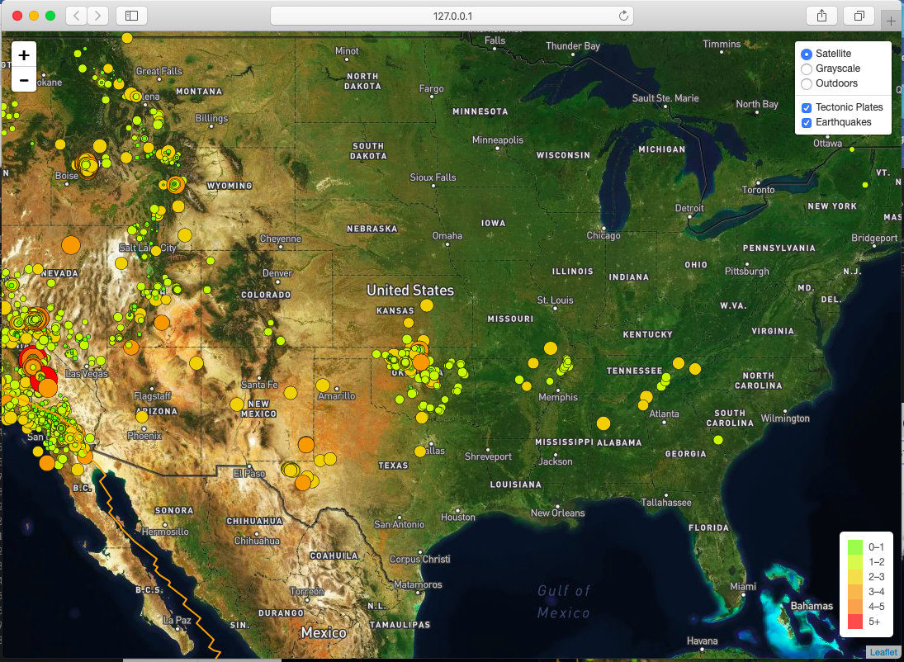
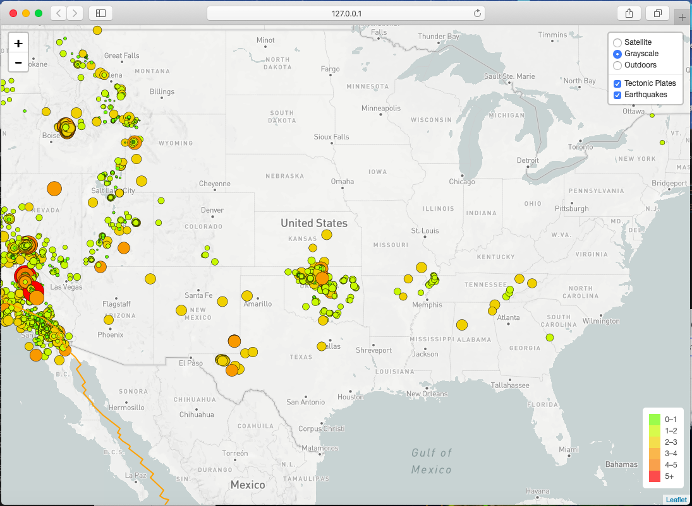
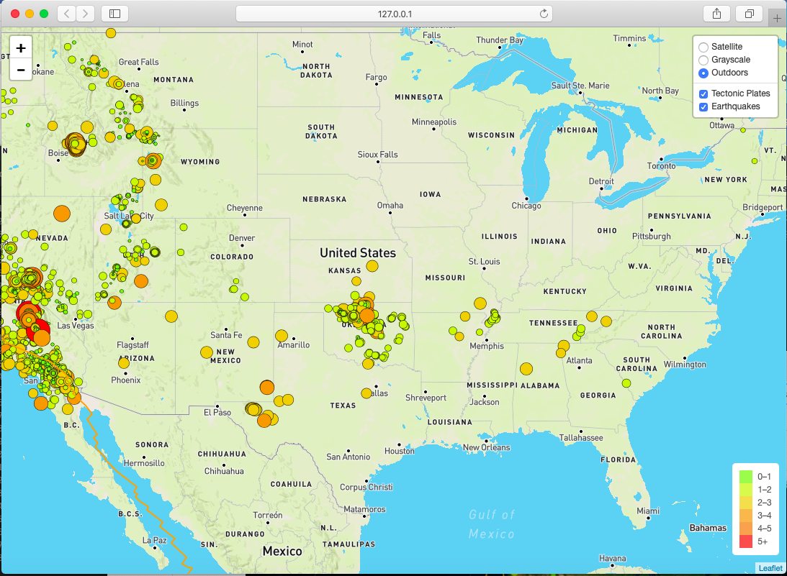

# leaflet-challenge

In this project, I have visualized earthquakes occurring globally using a live API feed provided by the USGS(United States Geological Survey). The data in the feed is updated every 5 mins, and includes all earthquake data for the Past 7 Days. I have also included an additional layer of tectonic plates to understand the relationship between tectonic plates and seismic activites.

Web application is deployed at the following link

https://monalipatel.github.io/leaflet-challenge/.

 
 
 
 
 
